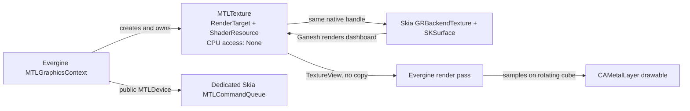

# SkiaSharp + Evergine Metal zero-copy interop

This .NET MAUI Mac Catalyst sample renders a changing 2D dashboard with
SkiaSharp Ganesh Metal directly into an Evergine-owned Metal texture. Evergine
samples that exact texture on a rotating, depth-tested 3D cube. There is no CPU readback,
pixel copy, staging texture, or texture upload after creation.

The running UI and console diagnostics report:

```text
CPU readbacks=0
CPU uploads after creation=0
native MTLTexture stable=True
backend=Evergine Metal + Skia Ganesh Metal
```

## Data flow



The final Evergine render pass rasterizes the textured cube into the window
drawable as normal. The zero-copy claim is specifically the Skia-to-Evergine
dashboard texture path: Evergine samples the same allocation Skia rendered.

## Prerequisites

- Apple silicon Mac
- Xcode 26.6 or a version supported by the installed .NET 10 workload
- .NET SDK 10.0.400
- .NET MAUI Mac Catalyst workload

Install the workload, restore, test, and build:

```bash
dotnet workload install maui-maccatalyst
dotnet restore SkiaSharpGraphicsInteropSamples.slnx
dotnet test tests/EvergineMauiMetal.Interop.Tests/EvergineMauiMetal.Interop.Tests.csproj
dotnet build samples/EvergineMauiMetal/EvergineMauiMetal.csproj
```

Run from the command line:

```bash
dotnet build samples/EvergineMauiMetal/EvergineMauiMetal.csproj \
  -t:Run -f net10.0-maccatalyst
```

The project defaults to `maccatalyst-arm64`.

## Public API contract

The implementation uses only public package and platform APIs:

- `MTLGraphicsContext.device` and `GraphicsContext.NativeDevicePointer`
- `MTLTexture.NativeTexture` and `Texture.NativePointer`
- `GRMtlBackendContext`, `GRMtlTextureInfo`, `GRBackendTexture`, and
  `SKSurface.Create`
- `CAMetalLayer` and `ICAMetalDrawable`

The MAUI handler owns a `CAMetalLayer` because Evergine's public
`MTLSwapChain` synchronously waits for its first drawable. That behavior can
block the Catalyst UI thread when the layer has not made a drawable available.
The sample instead asks once per timer tick and skips the frame when
`NextDrawable()` returns `null`; it does not spin or substitute a CPU path.
Each drawable texture is wrapped temporarily in a public Evergine
`MTLFrameBuffer`.

No Evergine source is copied, and the sample does not use reflection or access
internal fields.

## Ownership and lifetime

| Resource | Owner | Lifetime |
|---|---|---|
| `MTLGraphicsContext` and public `MTLDevice` | `MetalInteropRenderer` | Renderer |
| Dashboard `MTLTexture` | Evergine | Renderer; disposed after Skia wrappers |
| `GRBackendTexture` and `SKSurface` | `SkiaMetalTextureBridge` | Renderer |
| Dedicated Skia `MTLCommandQueue` | `SkiaMetalTextureBridge` | Same as Evergine context |
| Evergine render queue | `MetalInteropRenderer` | Renderer |
| `CAMetalLayer` | `MetalHostView` | Native MAUI view |
| Drawable texture wrapper/framebuffer | Current frame | Disposed after presentation |

Skia's backend wrappers reference the Evergine texture; they do not create or
own a second texture allocation.

## Synchronization contract

The proof of concept deliberately favors an explicit, easy-to-audit ordering
contract over throughput:

1. Skia records dashboard rendering on its dedicated Metal queue.
2. `SKSurface.Flush(submit: true, synchronous: true)` submits and waits.
3. Evergine samples the shared texture on its own render queue.
4. `CommandQueue.WaitIdle()` completes Evergine rendering before presentation
   and before the next Skia write.

This synchronization is **CPU-blocking but memory-zero-copy**. A production
adapter should replace these waits with shared Metal events or fences when the
engine exposes the required queue/submission hooks.

`InteropFrameContract` makes the legal ordering testable, and
`ZeroCopyDiagnostics` checks that the native dashboard texture handle remains
stable while recording all explicit CPU transfer paths. The sample contains no
calls that increment either transfer counter.

## Package versions

These were the latest stable NuGet versions when the sample was implemented:

| Package | Version |
|---|---:|
| Evergine.Common | 2026.5.26.1667 |
| Evergine.Mathematics | 2026.5.26.1667 |
| Evergine.Metal | 2026.5.26.1667 |
| SkiaSharp | 4.151.2 |
| SkiaSharp.NativeAssets.MacCatalyst | 4.151.2 |
| Microsoft.Maui.Controls | 10.0.100 |

Versions are centralized in
[`Directory.Packages.props`](../../Directory.Packages.props).

## Known limitations

- Mac Catalyst on Apple silicon is the only implemented and tested target.
- Synchronization serializes the two GPU queues and blocks the CPU.
- The dashboard texture is fixed at 1024 x 1024.
- The custom host is intentionally a minimal sample adapter, not a complete
  Evergine scene/lifecycle integration.
- Graphite is not used; this sample targets Skia Ganesh Metal.

### Direct3D 12 status

A Windows adapter is intentionally not included. In Evergine
2026.5.26.1667, `DX12GraphicsContext.DXDevice` is public, but the native
`ID3D12CommandQueue` required by `GRD3DBackendContext` has no public getter or
advertised native-pointer key. `DX12CommandQueue.CommandQueue` is internal.
Without the actual queue, a truthful shared-queue implementation is impossible,
and separate queues would require explicit fence integration that the public
submission contract does not expose. SkiaSharp.Direct3D.Vortice 4.151.2 was
also inspected; reflection and CPU-copy fallbacks were rejected.

## Replacing the Evergine adapter

AVEVA or another engine integrator can keep `SkiaMetalTextureBridge`,
`InteropFrameContract`, and `ZeroCopyDiagnostics` while replacing
`MetalInteropRenderer` with an adapter that:

1. Creates a private render-target/shader-resource Metal texture with no CPU
   access.
2. Exposes the public `MTLDevice` and exact `MTLTexture` handle to the bridge.
3. Samples the texture only after the Skia completion signal.
4. Prevents the next Skia write until engine sampling completes.
5. Disposes Skia wrappers before releasing the engine-owned texture.

## References

- [Evergine EverSneaks MAUI examples](https://github.com/EvergineTeam/EverSneaks)
- [Evergine documentation](https://docs.evergine.com/)
- [SkiaSharp API reference](https://learn.microsoft.com/dotnet/api/skiasharp)
- [Apple Metal documentation](https://developer.apple.com/documentation/metal)
