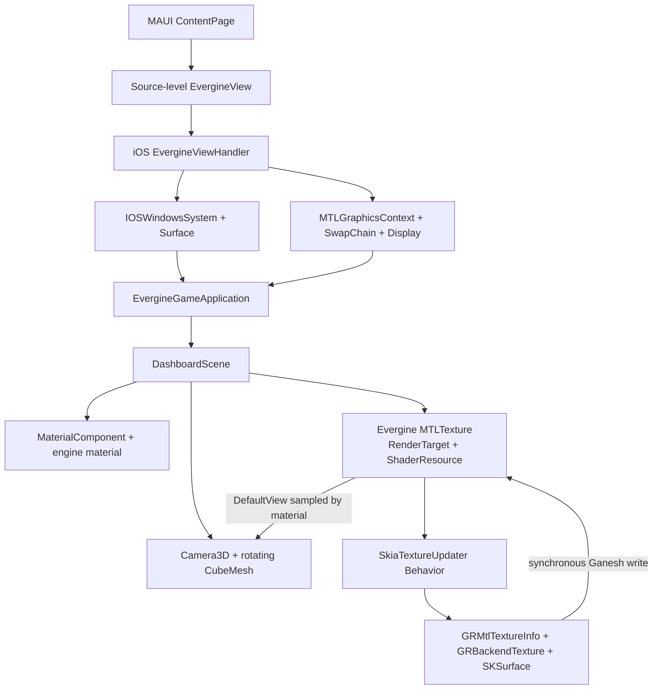

# SkiaSharp UI in an Evergine-owned Metal texture

This .NET MAUI iOS sample hosts a genuine Evergine Framework application.
Evergine owns the application lifecycle, display, scene, rotating cube,
material, GPU texture, and draw submission. `SkiaTextureUpdater`, an Evergine
`Behavior`, only renders a changing SkiaSharp dashboard into the texture that
the engine gives it.

The implementation is zero-copy at the application boundary: the Evergine
material and Skia Ganesh wrap the same native `MTLTexture`. It does not read
pixels to the CPU, upload a second texture, or issue a texture-to-texture copy.

## Architecture



`App` places `EvergineView` directly in its window. It does not create a Metal
layer, graphics device, queue, shader pipeline, cube, command buffer, timer, or
frame loop. The handler creates the Evergine application when the view connects,
stops the iOS display link when it disconnects, and then disposes the
engine-owned scene and GPU resources.

`EvergineView` and its handler are original source in this repository, following
the architecture of Evergine's official
[EverSneaks MAUI sample](https://github.com/EvergineTeam/EverSneaks). They are
not a prepackaged Evergine MAUI control. The handler uses the public
`EvergineViewController`, `IOSWindowsSystem`, `WindowsSystem.CreateSurface`,
`MTLGraphicsContext`, `SwapChain`, `Display`, and `GraphicsPresenter.AddDisplay`
APIs. `IOSWindowsSystem.Run` drives `Application.Initialize`, `UpdateFrame`, and
`DrawFrame`.

`DashboardScene` is a real `Scene`. Its standard `EntityManager`,
`BehaviorManager`, and `RenderManager` manage:

- a camera entity with `Transform3D` and `Camera3D`;
- a cube entity with `Transform3D`, `CubeMesh`, `MeshRenderer`,
  `MaterialComponent`, and `Spinner`;
- `SkiaTextureUpdater`, attached as an engine `Behavior`.

The procedural material uses an original, source-defined Metal effect. Evergine
still owns material resources, mesh batching, pipeline creation, command
buffers, rendering, and presentation. A pre-authored Metal shader is necessary
on iOS because stable `Evergine.HLSLEverywhere` 2026.5.26.1667 does not publish
an iOS runtime for on-device HLSL translation.

## Why iOS Simulator

Evergine 2026.5.26.1667 publicly supports MAUI hosting on iOS through
`Evergine.iOS`. Its public packages include `IOSWindowsSystem` and
`EvergineViewController`, which provide the full Evergine application loop.
There is no equivalent stable public Mac Catalyst window-system package.
Calling low-level `Evergine.Metal` APIs from a custom Catalyst timer would not
truthfully represent an Evergine game, so this sample targets
`net10.0-ios`/`iossimulator-arm64`.

## Texture ownership

`DashboardScene` creates the dashboard texture through the Evergine resource
factory with:

```text
Texture2D
R8G8B8A8_UNorm
RenderTarget | ShaderResource
CpuAccess.None
ResourceUsage.Default
```

Evergine owns and disposes the `MTLTexture`. The engine material samples its
`DefaultView`. `SkiaTextureUpdater` receives the existing `Evergine.Metal.MTLTexture`,
and `SkiaMetalTextureBridge` wraps `MTLTexture.NativePointer` in
`GRMtlTextureInfo`, `GRBackendTexture`, and `SKSurface`. Disposing the bridge
releases only Skia wrappers, its `GRContext`, and its dedicated Metal command
queue; it never disposes the engine texture.

`SkiaTextureUpdater` records the original native handle and validates it before
each Skia write and after each Evergine presentation. The Skia bridge disposes
only its wrappers and command queue; the scene disposes the engine texture after
the behavior is destroyed.

## Per-frame ordering

The stable public Metal backend does not expose Evergine's native command queue.
Skia therefore uses a dedicated command queue from the same public
`MTLGraphicsContext.device`.

1. `SkiaTextureUpdater.Update` waits for Evergine's public
   `GraphicsPresenter.GraphicsCommandQueue` to become idle.
2. Skia draws the live dashboard into the shared native texture.
3. `SKSurface.Flush(submit: true, synchronous: true)` waits for Ganesh to
   finish.
4. Evergine's normal scene draw samples the texture on the cube.
5. `GraphicsPresenter.OnPresented` completes the engine phase before the next
   Skia write.

This is zero-copy memory flow, but deliberately CPU-blocking synchronization.
It favors a clear public-API contract over throughput. A production engine
adapter should use shared Metal events or fences if its render-stage API exposes
the necessary submission hooks.

The update and presentation callbacks implement the legal
engine-ready -> Skia-writing -> Evergine-sampling -> engine-ready sequence.
Runtime diagnostics report the real frame count, backend, and native-handle
stability:

```text
Interop initialized: backend=Evergine Metal + Skia Ganesh Metal, shared nativeTexture=0x...
Interop status: frame=300, native handle stable=True, backend=Evergine Metal + Skia Ganesh Metal.
```

Native-handle stability proves both libraries retain the same application-level
texture identity. It does not claim that a driver performs no internal work;
use an Xcode Metal capture to inspect driver-level behavior.

## Build and run

Requirements:

- Apple silicon Mac
- Xcode with an iOS 26 simulator runtime
- .NET SDK 10.0.400
- .NET MAUI iOS workload

```bash
dotnet workload install maui-ios
dotnet restore SkiaSharpGraphicsInteropSamples.slnx
dotnet build samples/EvergineMauiMetal/EvergineMauiMetal.csproj \
  -f net10.0-ios \
  -p:RuntimeIdentifier=iossimulator-arm64
dotnet build samples/EvergineMauiMetal/EvergineMauiMetal.csproj \
  -t:Run \
  -f net10.0-ios \
  -p:RuntimeIdentifier=iossimulator-arm64
```

The simulator build does not require code signing. The sample was locally
observed past frame 1200 with a stable native texture handle and a visibly
rotating dashboard cube.

## Package versions

Versions are centralized in
[`Directory.Packages.props`](../../Directory.Packages.props).

| Package | Version |
|---|---:|
| Evergine.Common | 2026.5.26.1667 |
| Evergine.Components | 2026.5.26.1667 |
| Evergine.Framework | 2026.5.26.1667 |
| Evergine.iOS | 2026.5.26.1667 |
| Evergine.Mathematics | 2026.5.26.1667 |
| Evergine.Metal | 2026.5.26.1667 |
| SkiaSharp | 4.151.2 |
| SkiaSharp.NativeAssets.iOS | 4.151.2 |
| Microsoft.Maui.Controls | 10.0.100 |

These were the latest stable public packages when this implementation was
validated.

## Applying the adapter in AVEVA or another engine

Keep texture creation and release in the engine's resource/scene owner. Pass the
engine texture and graphics device to a component at the engine's update or
render-stage boundary, wrap its native handle once, synchronously finish Skia
before material sampling, and prevent the next Skia write until engine sampling
completes. Dispose Skia wrappers before the engine releases the texture.

Do not move the engine's window, frame loop, scene, material, geometry, command
buffers, or presentation into the MAUI host. The host should only embed and
configure the engine view, as this sample does.

## Direct3D 12 note

This refactor intentionally implements only Metal. Evergine's D3D12 backend
exposes the device and texture, but not its internal native queue. A dedicated
Skia queue could potentially work only with explicit or synchronous
coordination and correct D3D12 resource-state handoff. That design needs a
separate validation effort.

## References

- [Evergine EverSneaks MAUI sample](https://github.com/EvergineTeam/EverSneaks)
- [Evergine application lifecycle](https://docs.evergine.com/2026.3.18/manual/basics/application.html)
- [Evergine scenes and entities](https://docs.evergine.com/2026.3.18/manual/basics/scenes.html)
- [Evergine procedural primitives](https://docs.evergine.com/2026.3.18/manual/graphics/3d/primitives.html)
- [Evergine texture concepts](https://docs.evergine.com/2026.3.18/manual/graphics/textures/index.html)
- [SkiaSharp API reference](https://learn.microsoft.com/dotnet/api/skiasharp)
- [Apple Metal documentation](https://developer.apple.com/documentation/metal)
